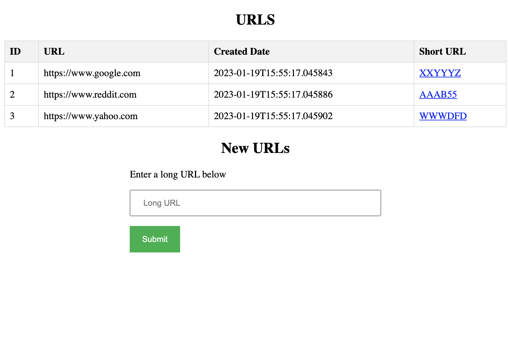
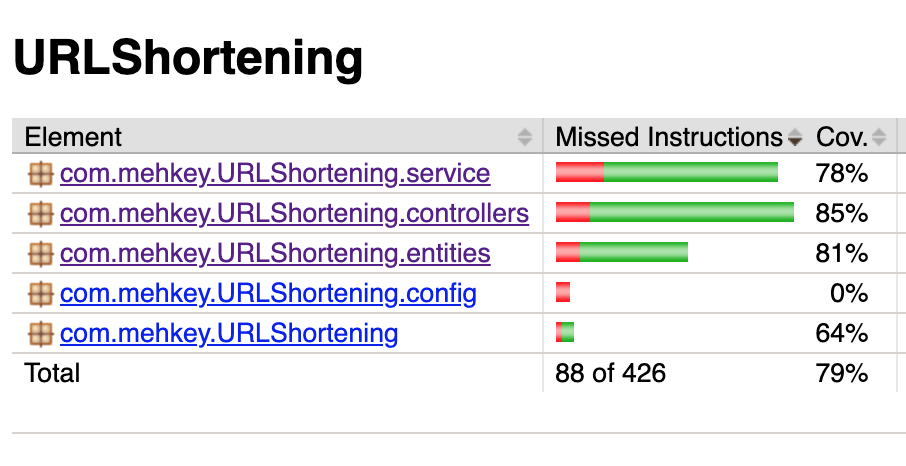

# URL Shortening Service with Java Spring Boot


## [Original Design for URL Shortening Service](https://github.com/mehkey/system-design/tree/main/designs/URLShortner)

Java Spring boot URL Shortening Service containing the following components:

+ WebClient Test
+ Controller
+ Service
+ DAO Repository
+ Entity
+ Test SQL
+ Gradle
+ 404 page
+ config file
+ docker compose for Redis and Postgres

## Docker Commands

> gradle build

> gradle test

> docker build -t urlshortening .

> docker run -p 8080:8080 --name urlshortening -d urlshortening


# URL Redirect API

This API allows for the redirecting of shortened URLs to their original, full URLs.

## Endpoints

### GET `/{shortUrl}`

Redirects the user to the full URL associated with the given short URL.

#### Parameters

- `shortUrl`: (required) The shortened URL.

#### Responses

- `302 Found`: The user is successfully redirected to the full URL.

- `404 Not Found`: The provided short URL is not valid or has expired.


# URL Shortener API

This API allows for the creation and retrieval of shortened URLs.

## Endpoints

### GET `/url/{id}`

Retrieves the URL associated with the given id.

#### Parameters
- `id`: (required) The id of the URL.

#### Responses
- `200 OK`: The URL is successfully retrieved and returned in the response body.
- `404 Not Found`: The provided id does not match any existing URLs.

Example Request:
HTTP/1.1


Example Response:
HTTP/1.1 200 OK
Content-Type: application/json


```json

{
    "id": 1,
    "url": "https://www.example.com",
    "createdDate": "2022/01/01 12:00:00",
    "shortUrl": "https://localhost/1"
}
```

### POST `/url`

Creates a new shortened URL.

#### Parameters
- `url` : (required) the original URL

#### Responses
- `201 Created`: The URL is successfully created and the location of the new resource is returned in the `Location` header.
- `400 Bad Request`: The provided url or short url is not valid.


Example Request:
HTTP/1.1
Content-Type: application/json

```json
{
    "url": "https://www.example.com"
}
```

Example Response:
HTTP/1.1 201 Created
Content-Type: application/json
Location: /url/2
```
{
    "id": 2,
    "url": "https://www.example.com",
    "createdDate": "2022/01/01 12:00:00",
    "shortUrl": "http://short.ly/2"
}
```

### GET `/url/all`

Retrieves all the URLs.

#### Responses
- `200 OK`: A list of all the URLs is returned in the response body.

Example Request:

HTTP/1.1
Content-Type: application/json


Example Response:
HTTP/1.1 200 OK
Content-Type: application/json


```json
[
    {
        "id": 1,
        "url": "https://www.example.com",
        "createdDate": "2022/01/01 12:00:00",
        "shortUrl": "https://localhost/1"
    },
    {
        "id": 2,
        "url": "https://www.example2.com",
        "createdDate": "2022/01/02 12:00:00",
        "shortUrl": "https://localhost/2"
    }
]

```

### GET `/urls`

Retrieves all the URLs.

#### Responses
- `200 OK`: A an HTML page with a list of URLs and a form to submit new URLS.

e.g.




## Test Coverage



